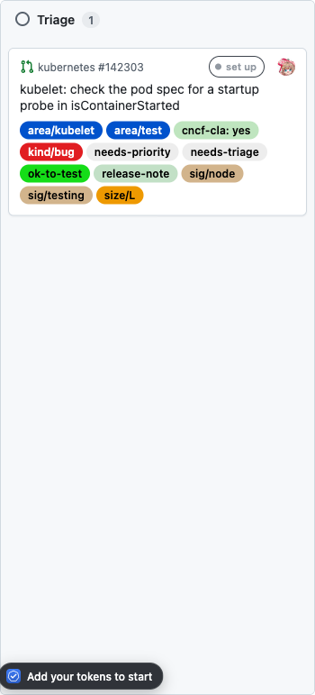
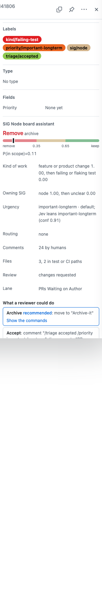
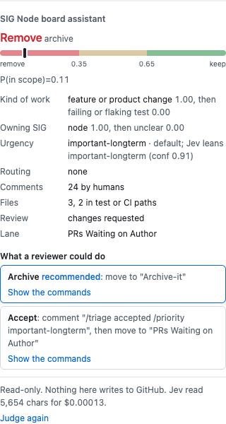

# SIG Node Board Assistant

A Chrome extension that puts a calibrated triage opinion on every card in the **Triage** column of the
[SIG Node CI/Test board](https://github.com/orgs/kubernetes/projects/151), right on the board you already
use. Open the item the way you always do and the evidence is there, as one more section in GitHub's own
sidebar: what the model answered, what the written policy decided and why, and the exact commands a reviewer
would run to act on it.

**It is read-only for now.** The extension never comments, labels or moves a card: every GitHub call it makes
today is a GET (`tests/github.test.ts` asserts it). The GitHub client is Octokit, so the approve step on the
roadmap can add writes without a new transport.

| on the board                                         | in GitHub's item pane (issues)                                   | on the PR page (pull requests)                       |
| ---------------------------------------------------- | ---------------------------------------------------------------- | ---------------------------------------------------- |
|  |  |  |

GitHub's project pane only exists for issues; a PR card opens the PR in a new tab. So the section is
rendered into whichever sidebar you land in, built from that page's own section markup so it matches.

## How it works

- **Jev decides, code computes.** Each card's thread and changed files are fetched over the GitHub REST
  API. The code computes the hard facts (human `/sig` routing, Prow state labels, review state, test-file
  share). [Jev](https://typesafe.ai), TypeSafe's decision model, is asked four calibrated questions about the
  item: does it belong on the board, what kind of work is it, which SIG owns it, how urgent is it. Jev never
  generates text and never acts.
- **The policy is written down.** `src/core/policy.ts` turns Jev's probabilities into KEEP, REMOVE or
  BORDERLINE with fixed thresholds and a tie-break for the grey zone, and says why in one sentence. The
  drawer draws that band so the decision explains itself.
- **No backend.** Everything runs in the extension: GitHub through [Octokit.js](https://github.com/octokit/core.js)
  (REST API version `2026-03-10`), Jev through the [TypeSafe SDK](https://github.com/typesafe-ai/typesafe-sdk-js).
- **Started as a port of the CLI.** The logic was ported from
  [sig-node-ci-assistant](https://github.com/harche/sig-node-ci-assistant). `tests/fixtures/parity.json` is a
  frozen snapshot of that reference's outputs (signals, Jev state, prompts, verdicts, commands); the extension is
  now the source of truth and the snapshot guards against unintended drift.

## Install

Until it is on the Chrome Web Store:

```bash
git clone https://github.com/harche/sig-node-board-assistant
cd sig-node-board-assistant
npm install
npm run build
```

Then open `chrome://extensions`, turn on **Developer mode**, choose **Load unpacked** and pick the `dist/`
folder. Click the extension's icon to open its settings and add:

- a GitHub **fine-grained personal access token** with resource owner `kubernetes`, organization permission
  _Projects: read_, and access to public repositories. The extension only sends GET requests, so a read-only
  token is all it can use.
- a **TypeSafe API key** from [typesafe.ai](https://typesafe.ai). Judging one card costs about $0.0002; answers
  are cached, so revisiting the board is free.

Both are stored in the browser's local extension storage, never synced, and sent only to `api.github.com`
and `api.typesafe.ai`.

Open the board. Cards in the Triage column get a badge as soon as they are judged; open one (issue pane or
PR tab) and the "SIG Node board assistant" section appears in the sidebar.

## Boards

| board                       | project        | what the extension does today       |
| --------------------------- | -------------- | ----------------------------------- |
| SIG Node CI/Test Board      | kubernetes/151 | judges the Triage column            |
| SIG Node Bugs               | kubernetes/185 | recognised, idle (workflow to come) |
| Dynamic Resource Allocation | kubernetes/95  | recognised, idle (workflow to come) |

Board and column names are configuration in `src/core/boards.ts`; adding a board is a table entry plus a
workflow.

## Develop

```bash
npm run watch        # rebuild dist/ on change; reload the extension in chrome://extensions
npm test             # vitest: unit tests + parity against the frozen reference snapshot
npm run lint         # eslint + prettier
npm run typecheck
npm run zip          # dist/ -> sig-node-board-assistant-<version>.zip
```

Layout:

```
src/core/        pure logic, no browser APIs: GitHub client, Jev client, signals, state, policy, prompts
src/background/  service worker: owns tokens and the cache, answers the content script's questions
src/content/     board page: badges, pane injection; the evidence block and its two sidebar adapters
src/item/        issue and PR pages: the same evidence block in the page sidebar
src/options/     settings page
tests/           vitest; fixtures/parity.json is a frozen snapshot of the CLI's outputs
docs/design.md   why it is shaped this way
```

See [CONTRIBUTING.md](CONTRIBUTING.md) and [docs/design.md](docs/design.md).

## Roadmap

1. Approve and skip buttons that run the shown commands, one click per action, after an explicit opt-in in
   settings. Same allow-list as the CLI: Status moves and Prow comments only.
2. The Bugs board (kubernetes/185) triage workflow.
3. Lane hygiene, reviewer finding and the To-do/In-progress sweep, as the CLI has them.
4. Chrome Web Store listing.

## License

Apache 2.0, the same as Kubernetes.
