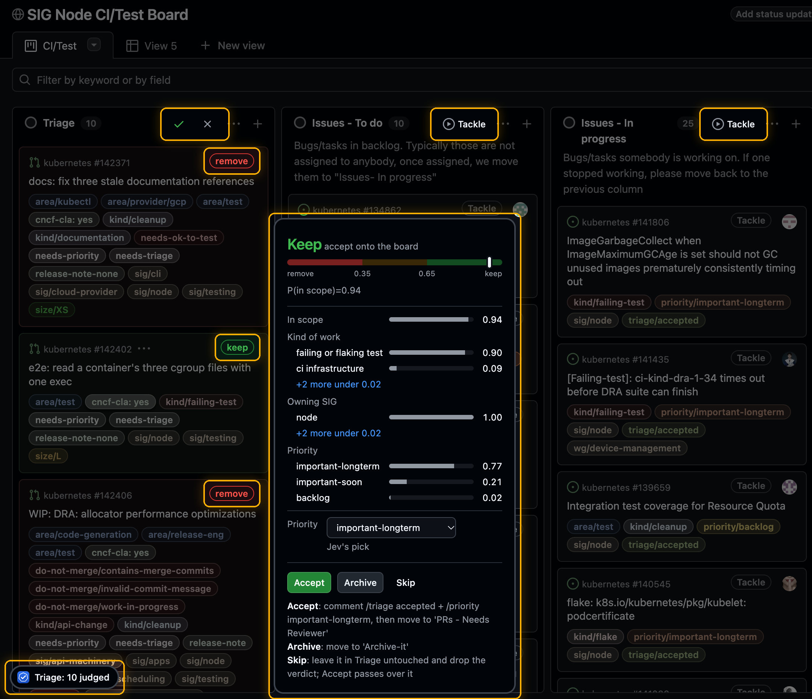
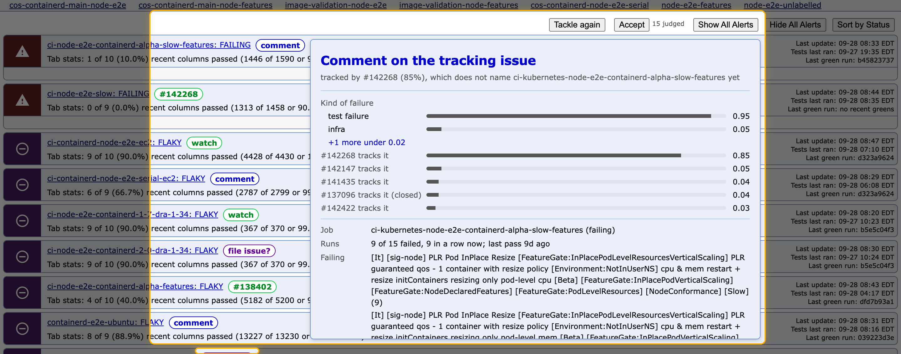
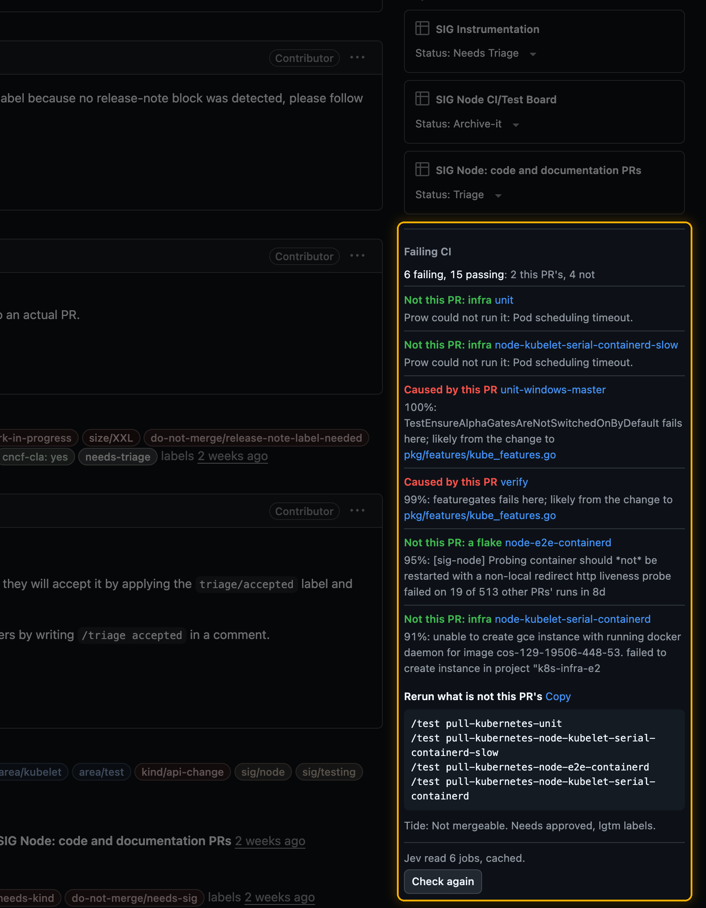
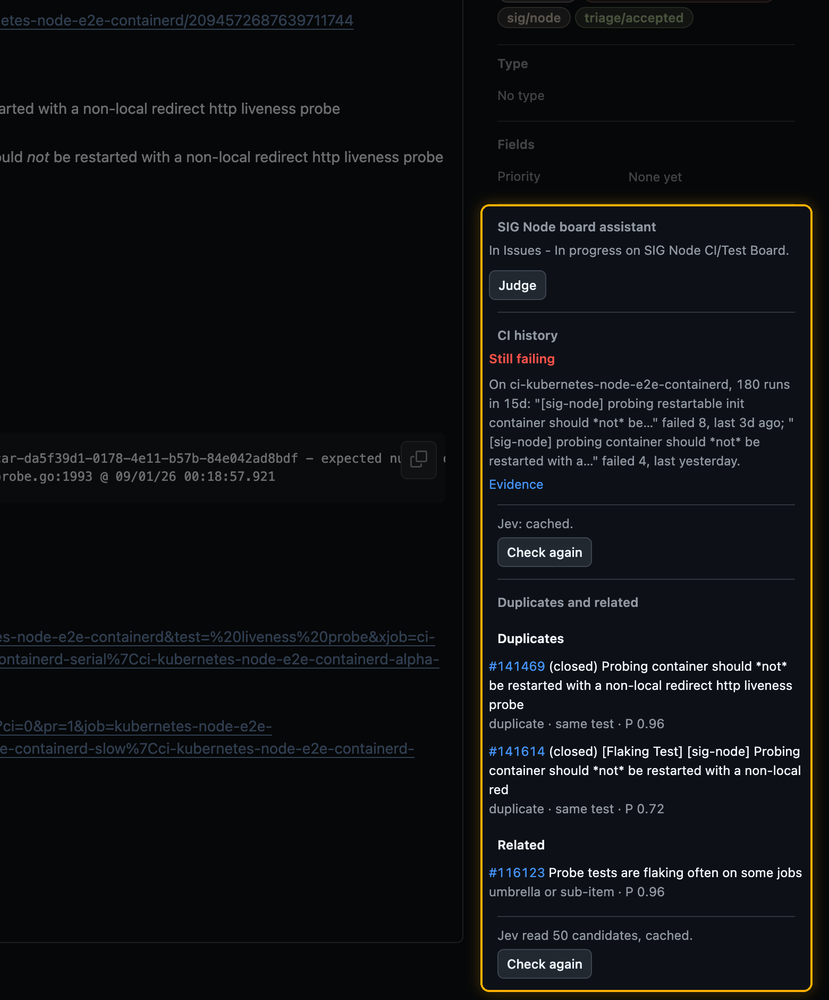
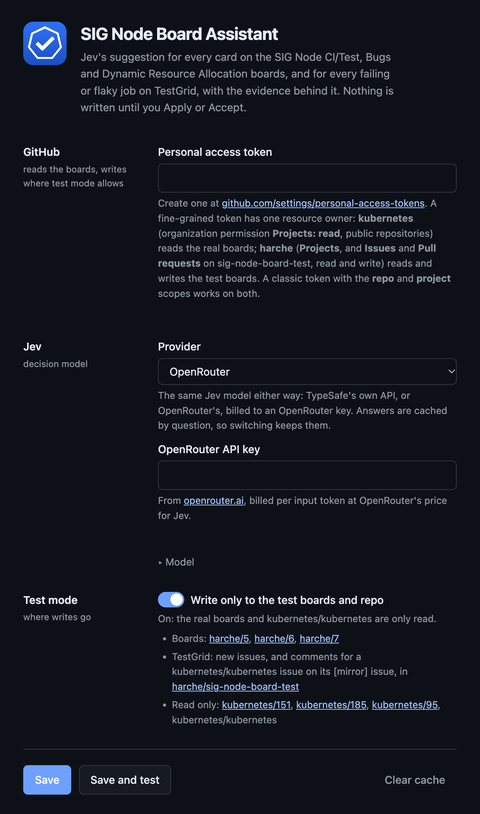

<div align="center">


# SIG Node Board Assistant

**A Chrome extension that helps Kubernetes SIG Node triage its project boards, CI failures and flaky tests, right
on the GitHub and TestGrid pages you already use.**

[Features](#features) · [Install](#install) · [How it decides](#how-it-decides) · [Safety](#safety) ·
[Docs](#documentation)

</div>

<br>



<sub>Screenshots highlight what the extension adds; the dimmed parts are GitHub's or TestGrid's own page.</sub>

## Features

### Project boards

Click **Tackle** on a column of the
[SIG Node CI/Test](https://github.com/orgs/kubernetes/projects/151),
[SIG Node Bugs](https://github.com/orgs/kubernetes/projects/185) or
[Dynamic Resource Allocation](https://github.com/orgs/kubernetes/projects/95) board. Each card gets a badge with a
suggested action:

- keep or remove;
- close as fixed or as a duplicate;
- nudge a quiet assignee;
- `/cc` reviewers picked from who actually reviews that code;
- move the card to the column its state calls for.

Hover a card for the evidence and Jev's answers. Change the action if you disagree, then **Apply** it, or **Accept**
the whole column. Open an item and the same evidence is a section in GitHub's own sidebar.

Every active column of all three boards has a workflow. [docs/workflows.md](docs/workflows.md) lists what each one
suggests and when.

### TestGrid



On a SIG Node dashboard at [testgrid.k8s.io](https://testgrid.k8s.io), **Tackle** reads every failing and flaky
job. For each one it works out:

- what fails, from the junit results and the build log;
- whether an issue already tracks it;
- what to do: nothing, comment on the tracking issue, or file a new issue from the kubernetes/kubernetes template.

It also names issues that may be the cause, or an umbrella for the failure.

### Pull requests: Failing CI



On a pull request with a failed Prow job, **Check failures** says for each job whether the PR broke it, or whether
it is a flake or infrastructure. It reads:

- the failed run's logs;
- the same tests' record on other PRs;
- the PR's diff, one changed file at a time.

A failure the PR caused links the file most likely behind it. The section ends with the `/test` or `/retest`
command that reruns only what is not the PR's, ready to copy.

<br clear="right">

### Issues: CI history and duplicates



On a SIG Node or DRA issue, **Check** answers two questions.

- Is the failure it reports still happening? It reads the tests' run history, and whether the newest failure is
  still the one the issue describes.
- Does the issue duplicate, or concretely relate to, another issue, open or closed? About 40 candidates come from
  keyword, semantic and exact-error searches, and Jev reads each one against the issue.

Nothing asks Jev on an issue or PR page until you click. The same button reads **Check again** afterwards.

<br clear="right">

### Feedback

Every card has a **Feedback** link: on the board's hover cards and item pane, on the issue and PR page sections, and
on TestGrid. Write what it got wrong and, if you like, pick what the outcome should have been. Submit opens an issue on
[harche/sig-node-board-assistant](https://github.com/harche/sig-node-board-assistant/issues) with what the card
showed and everything behind it: the card's result, the exact text and questions sent to Jev and its answers, and the
extension's version and commit. The dialog shows what will be attached before you send it. When that is too big for an
issue (a TestGrid job can take a megabyte), it goes to a secret gist on your account, which the issue links; that needs
the `gist` scope on a classic token. If your token cannot open issues there (a fine-grained token for the kubernetes
org cannot), Submit offers GitHub's prefilled new-issue page instead, linking the gist or with the attachments copied
for you to paste.

## Install

Install it from the
[Chrome Web Store](https://chromewebstore.google.com/detail/sig-node-board-assistant/ngimkkgeokllcnfdjeijegalfgkaemdj),
then click the extension's icon to open its settings.

Or build it from source (Node 20 or later):

```bash
git clone https://github.com/harche/sig-node-board-assistant
cd sig-node-board-assistant
npm install
npm run build
```

Then load it in Chrome:

1. Open `chrome://extensions` and turn on **Developer mode**.
2. Click **Load unpacked** and choose the `dist/` folder.
3. Click the extension's icon to open its settings.

Each [release](https://github.com/harche/sig-node-board-assistant/releases) also carries a built zip: unzip it and load
that folder the same way.

### Configure



The settings page needs two credentials:

- **A GitHub personal access token.** A classic token with the `repo` and `project` scopes works everywhere (add
  `gist` so large feedback can go to a gist). A
  fine-grained token needs **Projects: read** on the `kubernetes` organization, which is enough to read the real
  boards.
- **A key for Jev**, the decision model. Pick either provider:
  - [TypeSafe](https://typesafe.ai);
  - [OpenRouter](https://openrouter.ai/settings/keys), which serves the same model.

  Judging a card costs about $0.0002. Every judgment reads GitHub and asks Jev fresh.

**Save and test** checks both connections.

<br clear="right">

## How it decides

- **Code computes, Jev decides.** The extension fetches each item's thread, linked PRs, changed files and CI history.
  - Code computes the hard facts: labels, `/sig` routing, review state, assignees, run history.
  - [Jev](https://typesafe.ai), a decision model, answers calibrated questions about them, such as "is this
    resolved?", "is the assignee still on it?" or "could this file's change cause this failure?". It returns
    probabilities, never generated text, and it never acts.
- **The policy is written down.** Code in `src/core/` turns Jev's probabilities into one action, using fixed
  thresholds, and gives the reason in one sentence. The hover card draws the bands, so every suggestion shows how it
  was reached.
- **Tuned on the boards' own history.** Each workflow was measured against what maintainers actually did: 662 merged
  PRs for reviewer picks, 284 triaged bugs, 485 DRA moves, 167 CI failures, and more.
  [docs/design.md](docs/design.md) has the trials and the numbers.
- **No backend.** Everything runs in your browser. The extension talks directly to the GitHub API, to your chosen
  Jev provider, and to TestGrid's public data.

## Safety

- **Nothing is written until you click.** Apply writes one card's action, and Accept writes the actions in one
  column. Both show the exact comment and move first. The PR and issue checks never write: they only show a command
  for you to post. Feedback opens an issue on this extension's repo only when you click Submit.
- **The settings page lists where writes go:** the boards Apply and Accept may write to, and the repos TestGrid's
  issues and comments go to.
- **An allow-list guards every write.** The background worker accepts only a Status move of the one item, and only
  the comment shapes the extension drafts. It refuses anything else, whatever the page asks for.
  [docs/workflows.md](docs/workflows.md#what-apply-and-accept-may-write) lists them.

### Your keys

- **Stored locally.** The token and keys are kept in the browser's local extension storage, which is never synced.
  That storage is closed to the scripts the extension runs on GitHub and TestGrid pages: only the extension's
  background worker and its settings page can read it.
- **Never handed to a web page.** Every network call goes through the background worker. The scripts on web pages
  get settings with the keys blanked, and only the settings page can change settings.
- **Sent only where they are used:** `api.github.com`, and the Jev provider you picked (`api.typesafe.ai` or
  `openrouter.ai`). TestGrid is read without credentials.

The [privacy policy](docs/privacy.md) lists everything the extension stores and sends.

## Documentation

| Document                               | What it covers                                                |
| -------------------------------------- | ------------------------------------------------------------- |
| [docs/workflows.md](docs/workflows.md) | every column, the TestGrid review and the PR and issue checks |
| [docs/design.md](docs/design.md)       | the architecture, the policies and the trials behind them     |
| [CONTRIBUTING.md](CONTRIBUTING.md)     | setup, checks, and how to add a board or a workflow           |
| [CHANGELOG.md](CHANGELOG.md)           | what changed in each release                                  |
| [docs/privacy.md](docs/privacy.md)     | what the extension stores and sends, and where                |

## Development

```bash
npm run watch        # rebuild dist/ on every change; then reload the extension in chrome://extensions
npm test             # unit tests, plus parity against a frozen snapshot of the original CLI's outputs
npm run lint         # eslint and prettier
npm run typecheck
npm run zip          # a release build in release/ and its zip, leaving dist/ alone
npm run judge -- kubernetes/151   # judge a board's Triage column from the terminal, read-only
```

| Path              | What it holds                                                                                    |
| ----------------- | ------------------------------------------------------------------------------------------------ |
| `src/core/`       | the logic, with no browser APIs: GitHub, Jev and TestGrid clients, signals, prompts and policies |
| `src/background/` | the service worker: holds the keys, makes every network call, checks every write                 |
| `src/content/`    | the board page: column buttons, badges, hover cards, the pane section                            |
| `src/item/`       | issue and PR pages: the board section, Failing CI, CI history and duplicates                     |
| `src/testgrid/`   | TestGrid dashboards                                                                              |
| `src/options/`    | the settings page                                                                                |

The logic started as a port of the
[sig-node-ci-assistant](https://github.com/harche/sig-node-ci-assistant) CLI. This repository is now where the
policy lives.

## Roadmap

- Posting the PR page's rerun command through the same checked write path.
- Grouping TestGrid jobs that fail the same way into one issue.

## License

[Apache 2.0](LICENSE), the same as Kubernetes.
